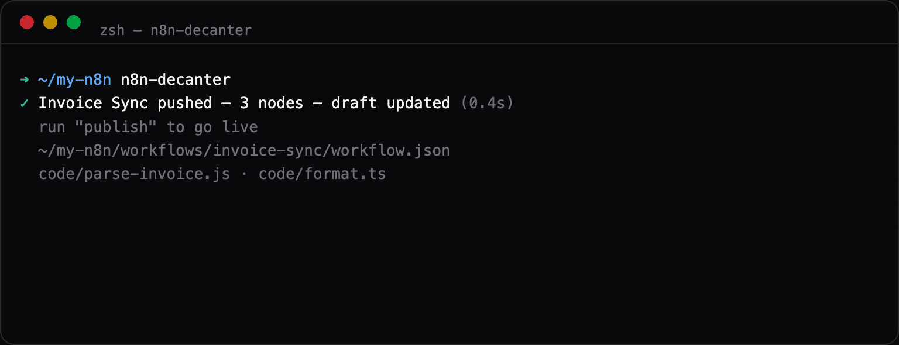
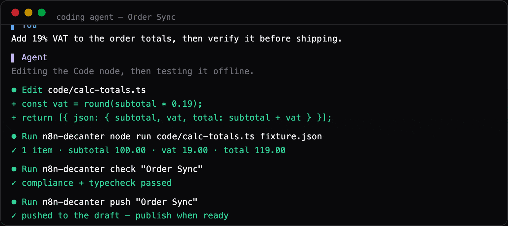

# n8n-decanter

[](https://github.com/buttjer/n8n-decanter/actions/workflows/ci.yml)
[](https://www.npmjs.com/package/n8n-decanter)
[](https://buttjer.github.io/n8n-decanter/)
[](LICENSE)
[](https://claude.com/claude-code)

**Work on n8n like a codebase — built for AI coding agents.**

**Pre-1.0 — breaking changes to the data model or CLI may ship in minor
versions until v1.0.**

> **Built with AI agents.** Much of this codebase was written by Claude Code
> under human review. It's tested (CI + a real-n8n integration suite) and used
> in earnest, but treat pre-1.0 the way the version implies.

n8n-decanter syncs your n8n instance into a git-friendly, folder-per-workflow
layout: every Code node's source becomes its own `.js` or `.ts` file,
editable in your IDE or by your agent, and pushed back through the n8n API.



- **Real version control** — meaningful diffs, PRs, blame; every push and
  pull is auto-committed.
- **TypeScript or typed JS** — write nodes in TS (compiled on push); n8n
  globals (`$input`, `$('…')`, …) are typed in both.
- **Agent-native** — `init` scaffolds Claude Code / Cursor / Codex configs
  and verification hooks; offline `check` and `node run` give agents a
  credential-free feedback loop.
- **Guardrails** — a compliance guard and typecheck gate block broken
  pushes; a drift guard keeps you from clobbering remote edits.
- **Real execution data on tap** — `executions` fetches recent run JSON into
  a gitignored temp dir, so agents see actual payload shapes (and build
  accurate `node run` fixtures) instead of guessing; `executions clean` removes
  it when done.
- **Engine-true simulation** — `simulate` replays a whole workflow through a
  real n8n engine using a captured execution as the mock: pure nodes run for
  real, network nodes pinned, credentials stripped. It diffs each node against
  the capture (exits 1 on divergence — a CI-gateable regression check) and, in
  a terminal, prints a URL to open the run in the n8n webapp.
- **Live editing** — `watch` pushes on save and auto-reloads the n8n editor
  tab via a local proxy.
- **Shared code and small libraries** — `.ts` nodes import helpers/types
  from `shared/` and opted-in npm packages; push bundles them into
  self-contained nodes that run anywhere, n8n Cloud included.
- **Built for n8n 2.x** — the draft/publish model is a first-class citizen
  (push tells you whether code went live or stayed a draft), and every
  behavior that touches the API is verified against a real n8n 2.x instance
  by an automated integration suite.



📖 **Full documentation: [buttjer.github.io/n8n-decanter](https://buttjer.github.io/n8n-decanter/)**

## Setup

Requires Node >= 22.18 — the CLI is TypeScript (`.mts`), executed natively
via Node's type stripping; there is no build step. **On older Node the CLI
fails at startup with a confusing `SyntaxError`** rather than a clean version
message: npm's `engines` field only *warns* at install time (unless you set
`engine-strict`). If you see a syntax error pointing into a `.mts` file,
check `node --version` first.

```sh
npm install -g n8n-decanter
n8n-decanter init [dir]   # prompts for host + API key, writes .env,
                          # copies template/, scaffolds config + .gitignore
```

From a git checkout instead: `npm link` (run `npm run build` once first — the
installed bin is the compiled `dist/`), or invoke `node n8n-decanter.mts …`
directly, no build needed.

`init` copies everything in [template/](template/); files named `X.example`
land as `X` (the suffix keeps agent configs inert in this repo, live in the
target). Re-running `init` is safe and **modification-aware**: it refreshes
template files you haven't edited (after a confirm), leaves your local changes
alone (reporting them as drift), and picks up files new to the template —
tracked via a `.decanter-template.json` baseline. `--force` is the escape hatch
that overwrites everything (`.env` is never touched). When `.env` already holds both values, init skips the
prompts and reuses them — edit or delete `.env` to change credentials. It
also does a best-effort credential check. Alternatively set up manually: `cp .env.example .env` and
fill it in. Then add workflow ids to `decanter.config.json`:

```json
{ "root": "./workflows", "workflows": ["0cXNQKKzmO0pXiCq"] }
```

**Prefer a scoped API key.** In n8n (Settings → n8n API → Create) create a key
limited to the permissions the CLI actually uses rather than a full-access one,
so a leaked `.env` has a small blast radius:

- `workflow:read`, `workflow:list`, `workflow:update` — `pull` / `status` / `push`
- `workflow:create`, `workflow:delete` — `create` / `delete`
- `workflow:activate`, `workflow:deactivate` — `publish` / `unpublish`
- `execution:read`, `execution:list` — the `executions` verb
- `dataTable:list`, `dataTable:read`, `dataTableColumn:read`, `dataTableRow:read`
  — the `data-tables` verb (only needed while `"dataTables"` is on, its default)

A full-access key also works if your n8n version predates scoped keys.

After every successful push **and pull**, the workflow's folder is
git-committed automatically (scoped to that folder; outside a git repo it
just warns). Set `"commitOnPush": false` / `"commitOnPull": false` to turn
that off.

`init` also scaffolds the TypeScript tooling a sync dir needs to type-check and
run nodes locally — `package.json` (with a `typecheck` script + the `typescript`
devDep), `tsconfig.json`, and `n8n-globals.d.ts` — plus a Claude Code
PostToolUse hook that runs `check` after node edits. Verification routes through
the CLI, so `n8n-decanter` must be on the sync dir's PATH: install it globally
(`npm i -g n8n-decanter`), add it to the sync dir's `devDependencies`, or
`npm link` a git checkout (build it first — Node won't type-strip `.mts`
under `node_modules`). The verbs `check`, `node run`, `rename`, and `node create` are fully
offline (no credentials, no network).

## Commands

```sh
n8n-decanter                        # interactive picker (terminal, inited
                                    #   project): filter workflows by typing —
                                    #   pulled green, unpulled remote yellow —
                                    #   then run verbs (unpulled: Enter pulls);
                                    #   stays in the workflow's menu between
                                    #   verbs, Esc backs out, Esc Esc quits
# Setup
n8n-decanter init [dir]             # interactive bootstrap (see Setup)
n8n-decanter completion zsh|bash    # print a shell completion script

# Sync
n8n-decanter pull [workflow…]       # remote -> workflows/<kebab>/
n8n-decanter push [workflow…] [--force] [--no-typecheck]
n8n-decanter watch [workflow]       # push a workflow's nodes on save
                                    #   (+ browser live-reload, opt-in)
n8n-decanter publish [workflow…]    # take the draft(s) live
n8n-decanter unpublish [workflow…]  #   (unpublish returns to draft-only)

# Workflow lifecycle
n8n-decanter create "<name>"                 # create a blank workflow, then pull it
n8n-decanter duplicate <workflow> ["<name>"] # clone a workflow, then pull it
n8n-decanter delete <workflow> [--force]     # delete from the server (folder kept)
n8n-decanter rename <workflow> "<new name>"  # rename the workflow (offline; folder stays)

# Inspect & test
n8n-decanter status [workflow…] [--diff]   # drift report (--diff: line diffs);
                                    #   exits 1 on conflict/remote drift
n8n-decanter check [workflow…]      # offline layout-compliance + typecheck
n8n-decanter executions [workflow…] [--status=success|error|waiting] [--limit=N]
                                    # fetch recent execution data (run JSON)
                                    #   into workflows/<folder>/executions/
                                    #   (gitignored; numeric arg = one by id)
n8n-decanter executions [workflow…] clean   # delete fetched execution data (offline)
n8n-decanter data-tables [table…] [--filter='<json>'] [--search=…] [--sort=col:asc|desc] [--limit=N] [--all]
                                    # fetch data-table schema + rows (read-only)
                                    #   into a gitignored top-level data-tables/;
                                    #   filter/search/sort pull a slice server-side
n8n-decanter data-tables [table…] clean     # delete fetched data-table data (offline)
n8n-decanter simulate <workflow> [--execution <execution-id>] [--network-none] [--json]
                                    # replay the whole workflow through a real
                                    #   n8n engine (Docker): pure nodes run for
                                    #   real, network nodes pinned from a capture,
                                    #   credentials stripped; diffs each node vs
                                    #   the capture, exits 1 on divergence. In a
                                    #   terminal, prints a URL to open the run in
                                    #   n8n. Defaults to the newest capture.
n8n-decanter simulate <workflow> --pin <execution-id>   # save a capture's outputs as fixtures/
n8n-decanter list [--remote] [--json]   # pulled workflows: name, id, folder
                                    #   (--remote adds unpulled ones; --json for tooling)

# Node
n8n-decanter node create <workflow> "<Node name>" [--ts]        # scaffold a Code node (offline)
n8n-decanter node rename <workflow> "<old node>" "<new node>"   # rename a node everywhere (offline)
n8n-decanter node run <node-file> [fixture.json] [--allow-env]  # run a node offline, print items
```

A `<workflow>` is its **id, its workflow/folder name, or a unique name
prefix** — `n8n-decanter push "Order Sync"` and `n8n-decanter push order` both
work. Matching is case-insensitive and never prompts: an ambiguous or unknown
name errors with the candidate list. `pull` resolves not-yet-pulled names
against the server's workflow list. Without a workflow argument, all workflows
from the config are processed (or, on a terminal, the picker opens). **The verb
comes first** (`n8n-decanter push wf123`); everything after it is an argument,
so a workflow named like a verb needs no special rule and verb-last errors with
*unknown verb*. Flags may still appear in any position.

Output is styled (color, `✓`/`!`/`✗` glyphs, progress) **only when writing to
a terminal** and respects `NO_COLOR`/`FORCE_COLOR`; piped or redirected output
is plain line-oriented text, safe for scripts and LLM harnesses. The
interactive picker follows the same rule: it exists only on a terminal —
a piped bare `n8n-decanter` prints plain usage text. For shell tab
completion of verbs, flags, and workflow names, append
`eval "$(n8n-decanter completion zsh)"` (or `bash`) to your shell rc.

`status` exits 1 when a pull is needed or a push would clobber remote work
(CONFLICT, remote-only changes, not pulled yet); local-only pending edits
exit 0 — scripts and CI can gate on it like on `check`. `status --diff`
shows the actual line diff under each drifted node, so you see what a push
would overwrite before running it. API requests time out after 30 s (set
`"requestTimeoutMs"` in `decanter.config.json` for slow instances), and
`DEBUG=1` prints full stack traces on errors. `node run` fakes the full Code-node
context including `$getWorkflowStaticData`, seeded from `workflow.json` and
overridable per fixture. Like n8n's own scoped `$env`, `node run`'s `$env` is
**empty by default** — set it explicitly with the fixture's `"env"` field, or
pass `--allow-env` to inherit the CLI process's environment (which may include
`N8N_API_KEY` and other secrets), so a node that prints `$env` never leaks the
host environment by accident.

`executions` is read-only against the API and writes each execution as
`workflows/<folder>/executions/<execution-id>.json` — real run data (the items every
node produced), meant as temporary reference for building `node run` fixtures.
The dir is written self-gitignored (run data can contain credentials/PII and
must never land in git); executions reflect the *published* workflow version
(n8n 2.x), so treat them as convenience data, not ground truth, and remove
them with `executions clean` when done.

`data-tables` is the data-table analogue: also read-only against the API, it
fetches each n8n data table's schema (`columns.json`) and rows (`rows.json`)
into a **top-level, gitignored** `data-tables/<table>/` dir (data tables are
project-scoped, not owned by a workflow) so you can develop and debug against
real table contents. `--filter='<json>'`, `--search`, and `--sort` pull only a
slice of a large table server-side (the applied filter is recorded in each
table's `meta.json`); `--limit`/`--all` control page size and exhaustion. It
never writes a data table. It's gated by the `"dataTables"` config key
(default on); `data-tables clean` removes the dir (offline). Data tables need
n8n ≥ 2.x.

## How it compares

n8n-decanter is **Code-node-first**: it optimizes the loop of writing, typing,
testing, and shipping the JavaScript/TypeScript *inside* your workflows. Here's
how that focus stacks up against the native editor and against
[n8n-as-code](https://github.com/EtienneLescot/n8n-as-code) — a broader,
whole-workflow authoring toolkit.

> **Choose [n8n-as-code](https://github.com/EtienneLescot/n8n-as-code) if you…**
> need an enterprise-ready automation framework — where AI agents assemble
> complete workflows, multi-environment Dev → Prod pipelines automatically handle
> credential governance, and full TypeScript GitOps ensures strict auditability
> across your team.
>
> **Choose n8n-decanter if you…** focus on developer experience inside the Code
> node — enabling typed TypeScript, shared utility libraries, and live
> hot-reloading DX directly between VS Code and your n8n canvas (even on Cloud).

| Capability | Native n8n (browser) | n8n-as-code | n8n-decanter |
|---|---|---|---|
| **TypeScript for Code nodes** | ❌ JavaScript or Python only | ❌ TS is at workflow level, not node logic | ✅ Code nodes as `.ts`, compiled on push, typed n8n globals |
| **Shared code in Code nodes** | ❌ self-host `NODE_FUNCTION_ALLOW_*` only; no libraries | ❌ not part of its model | ✅ `shared/*.ts` + npm bundled into self-contained nodes (Cloud-safe) |
| **Code as individual files** | ❌ no source files (JSON blob) | 🟡 one `.workflow.ts` per workflow | ✅ folder per workflow; each Code node its own `.js`/`.ts` |
| **Versioning** | 🟡 in-app history (DB snapshots, tiered retention); Git source control is Enterprise-only | ✅ GitOps sync of workflow source | ✅ real git — diffs, PRs, blame; auto-commit each push/pull |
| **Live editing** | ✅ the canvas (baseline) | 🟡 explicit pull/push, no auto-watch | ✅ `watch`: push on save + auto-reload the editor tab |
| **Offline testing on historic executions** | 🟡 re-run past executions / pin data, but online in-editor | 🟡 inspect executions against a live env | ✅ fetch real run JSON → offline `node run` fixtures, no creds/network |
| **Agent-native tooling** | 🟡 n8n's own canvas AI, not your agent on the codebase | ✅ Agent Workbench, skills, MCP, Claude/editor plugins | ✅ scaffolds Claude Code / Cursor / Codex configs + MCP; offline `check`/`node run` loop; guardrails |
| **Model ownership** | ❌ locked to n8n's own hosted AI; can't use your Claude subscription | 🟡 beta Claude Code plugin uses your subscription; flagship Workbench needs an Anthropic key for Claude | ✅ never calls an LLM itself — your agent/subscription does 100%, no key or model config ever |
| **Agentic workflow creation** | 🟡 AI Workflow Builder (natural language), but Cloud / plan-gated — credits, self-host needs setup | ✅ 537 node schemas + 7,700+ templates + skills | 🟡 today via scaffolded n8n-mcp; first-party repo-authored creation planned (`node create` + `push --create`) |
| **Whole-workflow TypeScript authoring** | ❌ | ✅ `.workflow.ts` decorator classes (structure + links) | ❌ keeps `workflow.json`; extracts Code-node source only |
| **Multi-environment promotion** | 🟡 Enterprise source control / environments | ✅ `promote` remaps creds + refs Dev→Prod | 🟡 separate sync dir per instance, but no `promote` (IDs/creds/refs not remapped) |

Legend: ✅ first-class · 🟡 partial or indirect · ❌ not supported.

**Bottom line:** reach for n8n-decanter when your workflows live or die by their
Code nodes — TypeScript, shared libraries, offline tests, and real git diffs.
n8n-as-code shines for whole-workflow authoring/generation and multi-environment
ops; the native editor stays the live visual canvas everything syncs back to. And
decanter makes no LLM calls of its own — you drive it with the coding agent you
already run, so Claude Code on a Claude subscription needs no extra API tokens.

## Caveats

- **Pushing to a *published* workflow republishes it immediately.** n8n 2.x
  splits each workflow into a draft and a published version — in the editor,
  *Save* updates the draft and *Publish* makes it live. The public API has no
  such split: `PUT /workflows/:id` hardcodes `publishIfActive: true`, so a push
  to an already-published workflow **goes live at once — there is no draft-only
  update through the API** (pushing to an *unpublished* workflow only updates
  its draft). This is an n8n API limitation, not decanter's; decanter surfaces
  the outcome — push prints `published: code is live now` vs `unpublished:
  draft only`, and `status`/`watch` show the state. The **`publish`** and
  **`unpublish`** verbs take a draft live / return it to draft-only from the
  CLI, so a staged rollout is `unpublish` → `push` → `publish` (triggers are
  down in between) without leaving the terminal, or push to a staging-copy
  workflow. On a published workflow whose draft has moved ahead in the UI,
  `status` says the live version is older than the draft (`push` or `publish`
  to catch it up).
- **n8n's optimistic locking isn't reachable through the API.** That same `PUT`
  also forces `forceSave: true` and exposes no version checksum, so the server
  won't reject a stale write. Decanter's **drift guard** is the only thing
  protecting remote edits from being clobbered — so always `pull` (or check
  `status`) before pushing. `--force` deliberately bypasses only this guard,
  never the compliance guard.

## How node files work

Node sources live in a `code/` subdir inside the workflow folder, named in
kebab-case after their node (`Parse Order` → `code/parse-order.js`).
Layouts from older versions (files at the folder root) migrate automatically
on the next `pull`.

- `code/<node>.js` — lossless: pulled/pushed byte-identical. Type-checked via
  JSDoc + `checkJs`. **No `import`s** — yes, `import` is standard JavaScript,
  but a `.js` node is pushed verbatim into n8n, where Code nodes cannot load
  modules; `check` rejects it. Imports are a `.ts`-only feature (bundled on
  push, next bullets).
- `code/<node>.ts` — one-way: local file is the source of truth. `push`
  compiles it (esbuild, comments stripped) and appends a
  `// @ts-n8n sha256:...` marker line; `pull` never touches the `.ts`.
  To convert a node, replace `code/<node>.js` with `code/<node>.ts` and change
  its `//@file:` placeholder in `workflow.json` to the `.ts` name.
- `shared/*.ts` — helpers and types **imported by `.ts` nodes** (values and
  types); push bundles the imports into the compiled node, so the pushed
  code is self-contained and runs anywhere — n8n Cloud included, no
  `NODE_FUNCTION_ALLOW_*` setup. Small npm packages bundle the same way:
  install them in the sync dir and list them under `"bundleDependencies"`
  in `decanter.config.json` (pure JS only; builtins and unlisted packages
  are compile errors, imports must sit at the top of the file). `.js` nodes
  stay import-free — that tier is byte-lossless by contract.
- `code/<node>.remote.js` — written by `pull` when the remote code changed in
  ways it can't merge (UI edit of a TS-managed node, conflict, missing local
  `.ts`). Port the changes manually, then push; the file is removed on the
  next in-sync pull.
- `.decanter.json` — per-folder state (node-id → file map, sync hashes).
  Commit it; don't edit it.

Push refuses to overwrite remote changes made since the last sync
(`pull first`, or `--force`). Pulling records the remote state as the new
sync base — after a warned pull, push *will* overwrite the surfaced remote
edits, with `.remote.js` + git as the safety net.

Push also runs a **compliance guard** first (standalone: `check`, which needs
no credentials): inline code without a `//@file:` placeholder, placeholders
pointing at missing/`.remote.js`/non-`.js`/`.ts` files or at files outside
`code/`, an `@ts-n8n` marker inside a `.js` file, dangling connection
sources/targets, duplicate node names or ids, orphan `.js`/`.ts` files
nothing references, and dangling literal `$('…')` references (in node source
and in expression parameters) all abort the push — `--force` does not bypass
these, only the drift guard. Unresolved `.remote.js` leftovers warn without
blocking. The typecheck runs as a blocking push gate too (`--no-typecheck` to
skip; auto-skipped when no `tsconfig.json` is found).

**Renaming a node** by hand means touching four places at once (name,
connections, `$('…')` references, filename) — use
`rename <id> "<old>" "<new>"` instead: it rewrites all of them atomically,
refuses colliding names, and re-validates the folder afterwards. It works
offline; `push` propagates the rename to n8n.

## Browser live-reload (watch)

Tired of ⌘R'ing the n8n editor after every push? Add `"browserReload":
"proxy"` to `decanter.config.json` and `watch` boots a transparent dev proxy
on `127.0.0.1:5679` (override with `"proxyPort"`):

```json
{ "root": "./workflows", "workflows": ["…"], "browserReload": "proxy" }
```

Open the n8n editor through the **proxy URL** (`http://localhost:5679`) instead
of the real port. The proxy pipes everything to your n8n host untouched — login,
assets, and n8n's native `/rest/push` WebSocket — and injects a tiny reload
client into the editor page. Every successful `watch` push then refreshes the
tab for you, **unless the editor has unsaved changes** (it declines the reload
and logs a console warning so nothing in-browser is clobbered). If the port is
taken, `watch` warns and keeps syncing without live reload.

Built on native Node (no extra deps). It's designed for a **local http** n8n
(`http://localhost:5678`); pointing it at an https/remote host is best-effort —
Secure cookies don't survive the plain-http hop, so auth may not carry through.

## Type checking

n8n Code node source is a function body (top-level `return`/`await`), which
plain `tsc` rejects in `.ts` files (TS1108). `npm run typecheck` therefore
runs [scripts/typecheck.mts](scripts/typecheck.mts), which wraps node files in
an `async function` in memory (a `.decanter.json` next to the file — or in the
parent of its `code/` dir — marks it as a node file) and maps diagnostics back
to real line numbers. The IDE's own tsserver doesn't apply the wrapper, so on
its own it would flag top-level `return`/`await` (TS1108/TS1375/TS1378) —
which is why `init` also scaffolds `decanter-ts-plugin/`, a language-service
plugin that suppresses exactly those codes on node files while every other
diagnostic stays live. It loads after `npm install` in the sync dir, via the
workspace TypeScript (VS Code prompts *Use Workspace Version* once; JetBrains
IDEs use the project TypeScript by default).

The CLI's own `.mts` sources are checked separately by `tsc -p
tsconfig.cli.json` (strict; the first half of `npm run typecheck`). That
config is not the root `tsconfig.json`, which belongs to the workflow node
files above.

*Not affiliated with or endorsed by n8n GmbH.*
