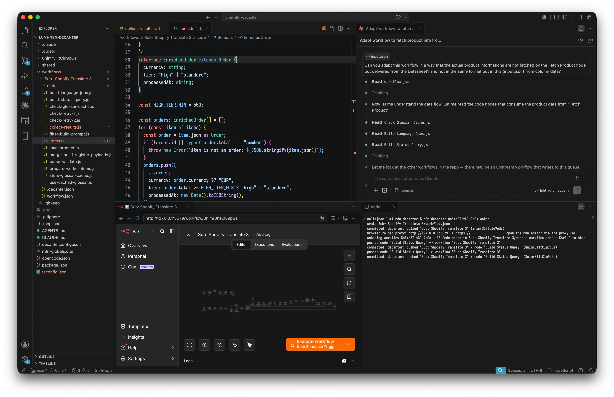

# n8n-decanter

[](https://github.com/buttjer/n8n-decanter/actions/workflows/ci.yml)
[](https://www.npmjs.com/package/n8n-decanter)
[](LICENSE)

**Work on n8n like a codebase — built for AI coding agents.**

n8n-decanter syncs your n8n instance into a git-friendly, folder-per-workflow
layout: every Code node's source becomes its own `.js` or `.ts` file,
editable in your IDE or by your agent, and pushed back through the n8n API.

- **Real version control** — meaningful diffs, PRs, blame; every push and
  pull is auto-committed.
- **TypeScript or typed JS** — write nodes in TS (compiled on push); n8n
  globals (`$input`, `$('…')`, …) are typed in both.
- **Agent-native** — `init` scaffolds Claude Code / Cursor / Codex configs
  and verification hooks; offline `check` and `run` give agents a
  credential-free feedback loop.
- **Guardrails** — a compliance guard and typecheck gate block broken
  pushes; a drift guard keeps you from clobbering remote edits.
- **Live editing** — `watch` pushes on save and auto-reloads the n8n editor
  tab via a local proxy.
- **Shared code across workflows** *(planned)* — value imports from
  `shared/` inlined into `.ts` nodes at push; today imports are type-only.



## Setup

Requires Node >= 22.18 — the CLI is TypeScript (`.mts`), executed natively
via Node's type stripping; there is no build step. **On older Node the CLI
fails at startup with a confusing `SyntaxError`** rather than a clean version
message: npm's `engines` field only *warns* at install time (unless you set
`engine-strict`). If you see a syntax error pointing into a `.mts` file,
check `node --version` first.

```sh
npm install
node n8n-decanter.mts init [dir]   # prompts for host + API key, writes .env,
                                   # copies template/, scaffolds config + .gitignore
```

`init` copies everything in [template/](template/); files named `X.example`
land as `X` (the suffix keeps agent configs inert in this repo, live in the
target). It never overwrites existing files (safe to re-run) unless you pass
`--force`, which re-copies template files over existing ones (`.env` is never
touched by it). When `.env` already holds both values, init skips the
prompts and reuses them — edit or delete `.env` to change credentials. It
also does a best-effort credential check. Alternatively set up manually: `cp .env.example .env` and
fill it in. Then add workflow ids to `decanter.config.json`:

```json
{ "root": "./workflows", "workflows": ["0cXNQKKzmO0pXiCq"] }
```

After every successful push **and pull**, the workflow's folder is
git-committed automatically (scoped to that folder; outside a git repo it
just warns). Set `"commitOnPush": false` / `"commitOnPull": false` to turn
that off.

`init` also scaffolds the TypeScript tooling a sync dir needs to type-check and
run nodes locally — `package.json` (with a `typecheck` script + the `typescript`
devDep), `tsconfig.json`, and `n8n-globals.d.ts` — plus a Claude Code
PostToolUse hook that runs `check` after node edits. Verification routes through
the CLI, so `n8n-decanter` must be on the sync dir's PATH: install it globally
(`npm i -g n8n-decanter`) or `npm link` it (from a git checkout, run
`npm run build` once first — the installed bin is the compiled `dist/`, since
Node won't type-strip `.mts` under `node_modules`). Once it's published to npm you can
instead add it to the sync dir's `devDependencies`. The verbs `check`, `run`,
and `uuid` are fully offline (no credentials, no network).

## Commands

```sh
node n8n-decanter.mts init [dir]             # interactive bootstrap (see Setup)
node n8n-decanter.mts [id...] pull           # remote -> workflows/<Name>/
node n8n-decanter.mts [id...] push [--force] [--no-typecheck]
node n8n-decanter.mts [id...] status         # local vs remote drift report
node n8n-decanter.mts [id...] check          # offline layout-compliance + typecheck
node n8n-decanter.mts <id> rename "<old node>" "<new node>"   # rename a node everywhere
node n8n-decanter.mts <id> rename --workflow "<new name>"     # rename the workflow
node n8n-decanter.mts [id] watch             # push a workflow's nodes on save
                                             #   (+ browser live-reload, opt-in)
node n8n-decanter.mts <node-file> run [fixture.json]   # run a node offline, print items
node n8n-decanter.mts uuid [count]           # lowercase v4 UUID(s) for new node ids
npm run typecheck                            # CLI sources (tsc) + workflow node files
npm test                                     # e2e against a mock n8n API
                                             # (binds a localhost port)
```

Without ids, all workflows from the config are processed. The verb may sit
anywhere among the arguments (`push wf123` == `wf123 push`) — the first token
matching a known verb is the command; flags may appear in any position too.

## How node files work

Node sources live in a `code/` subdir inside the workflow folder, named in
kebab-case after their node (`Parse Order` → `code/parse-order.js`).
Layouts from older versions (files at the folder root) migrate automatically
on the next `pull`.

- `code/<node>.js` — lossless: pulled/pushed byte-identical. Type-checked via
  JSDoc + `checkJs`.
- `code/<node>.ts` — one-way: local file is the source of truth. `push`
  compiles it (esbuild, comments stripped) and appends a
  `// @ts-n8n sha256:...` marker line; `pull` never touches the `.ts`.
  To convert a node, replace `code/<node>.js` with `code/<node>.ts` and change
  its `//@file:` placeholder in `workflow.json` to the `.ts` name.
- `code/<node>.remote.js` — written by `pull` when the remote code changed in
  ways it can't merge (UI edit of a TS-managed node, conflict, missing local
  `.ts`). Port the changes manually, then push; the file is removed on the
  next in-sync pull.
- `.decanter.json` — per-folder state (node-id → file map, sync hashes).
  Commit it; don't edit it.

Push refuses to overwrite remote changes made since the last sync
(`pull first`, or `--force`). Pulling records the remote state as the new
sync base — after a warned pull, push *will* overwrite the surfaced remote
edits, with `.remote.js` + git as the safety net.

Push also runs a **compliance guard** first (standalone: `check`, which needs
no credentials): inline code without a `//@file:` placeholder, placeholders
pointing at missing/`.remote.js`/non-`.js`/`.ts` files or at files outside
`code/`, an `@ts-n8n` marker inside a `.js` file, dangling connection
sources/targets, duplicate node names or ids, orphan `.js`/`.ts` files
nothing references, and dangling literal `$('…')` references (in node source
and in expression parameters) all abort the push — `--force` does not bypass
these, only the drift guard. Unresolved `.remote.js` leftovers warn without
blocking. The typecheck runs as a blocking push gate too (`--no-typecheck` to
skip; auto-skipped when no `tsconfig.json` is found).

**Renaming a node** by hand means touching four places at once (name,
connections, `$('…')` references, filename) — use
`rename <id> "<old>" "<new>"` instead: it rewrites all of them atomically,
refuses colliding names, and re-validates the folder afterwards. It works
offline; `push` propagates the rename to n8n.

## Browser live-reload (watch)

Tired of ⌘R'ing the n8n editor after every push? Add `"browserReload":
"proxy"` to `decanter.config.json` and `watch` boots a transparent dev proxy
on `127.0.0.1:5679` (override with `"proxyPort"`):

```json
{ "root": "./workflows", "workflows": ["…"], "browserReload": "proxy" }
```

Open the n8n editor through the **proxy URL** (`http://localhost:5679`) instead
of the real port. The proxy pipes everything to your n8n host untouched — login,
assets, and n8n's native `/rest/push` WebSocket — and injects a tiny reload
client into the editor page. Every successful `watch` push then refreshes the
tab for you, **unless the editor has unsaved changes** (it declines the reload
and logs a console warning so nothing in-browser is clobbered). If the port is
taken, `watch` warns and keeps syncing without live reload.

Built on native Node (no extra deps). It's designed for a **local http** n8n
(`http://localhost:5678`); pointing it at an https/remote host is best-effort —
Secure cookies don't survive the plain-http hop, so auth may not carry through.

## Type checking

n8n Code node source is a function body (top-level `return`/`await`), which
plain `tsc` rejects in `.ts` files (TS1108). `npm run typecheck` therefore
runs [scripts/typecheck.mts](scripts/typecheck.mts), which wraps node files in
an `async function` in memory (a `.decanter.json` next to the file — or in the
parent of its `code/` dir — marks it as a node file) and maps diagnostics back
to real line numbers. Known
limitation: the IDE's own tsserver doesn't apply the wrapper, so editors show
a spurious TS1108 on top-level `return` in `.ts` node files.

The CLI's own `.mts` sources are checked separately by `tsc -p
tsconfig.cli.json` (strict; the first half of `npm run typecheck`). That
config is not the root `tsconfig.json`, which belongs to the workflow node
files above.

## Open questions (need a live n8n instance)

Still unverified, from PLAN.md — check once `.env` points at the real host:

- Whether `GET /api/v1/workflows/:id` exposes folder placement
  (`parentFolderId`/project). Until then the layout is flat under `root`.
- Whether `PUT` preserves fields that are neither sent nor whitelisted
  (tags, pinned data) — round-trip an untouched workflow and diff.

---

*Not affiliated with or endorsed by n8n GmbH.*
