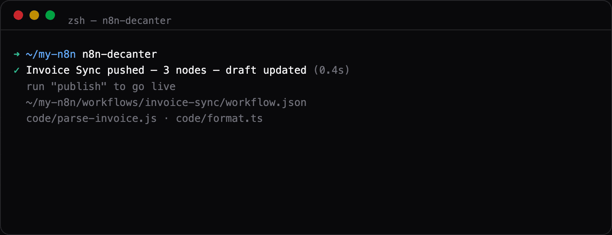
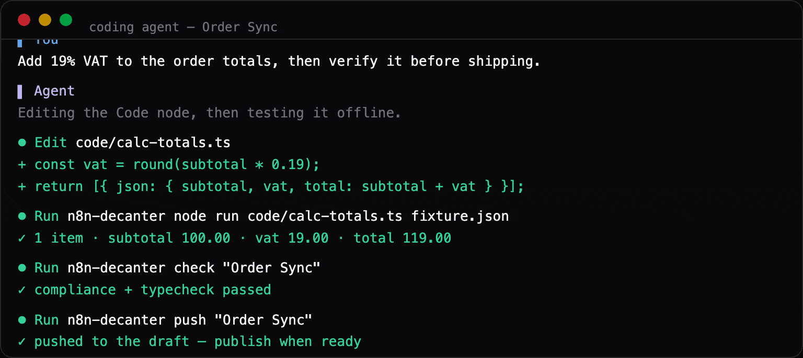

# n8n-decanter

[](https://github.com/buttjer/n8n-decanter/actions/workflows/ci.yml)
[](https://www.npmjs.com/package/n8n-decanter)
[](https://buttjer.github.io/n8n-decanter/)
[](LICENSE)
[](https://claude.com/claude-code)

**The toolkit for building code-heavy n8n workflows — agent-first, MCP-native.**

*Code nodes as files* — TypeScript, shared types & helpers, code-level git
versioning, preflights.

**Pre-1.0 — breaking changes to the data model or CLI may ship in minor
versions until v1.0.**

> **Built with AI agents.** Much of this codebase was written by Claude Code
> under human review. It's tested (CI + a real-n8n integration suite) and used
> in earnest, but treat pre-1.0 the way the version implies.

n8n-decanter puts your n8n **Code-node source** in git: a folder per workflow,
every Code node's source its own `.js` or `.ts` file, editable in your IDE or
by your agent, and synced back over **n8n's built-in MCP server** — draft-first,
so nothing goes live until you `publish`. decanter is your agent's **guarded
gateway** to that full MCP surface: it can create, read, update, and rename
whole workflows through it — blocking only one thing, writes to a Code node's
source, which decanter owns as files instead. It also mirrors each workflow's
structure into a read-only `workflow.json`, so structural changes show up as
clean git diffs.



- **Real version control** — meaningful diffs, PRs and blame per Code node;
  every push and pull is auto-committed.
- **TypeScript or typed JS** — write nodes in TS (compiled on push) or plain
  JS; n8n globals (`$input`, `$('…')`, …) are typed in both.
- **Shared code and small libraries** — `.ts` nodes import from `shared/` and
  opted-in npm packages, bundled on push to run anywhere, n8n Cloud included.
- **Agent-native** — `init` scaffolds Claude Code / Cursor / Codex configs;
  `preflight --offline` and `node run` give agents a credential-free loop.
- **Guarded agent access to n8n's MCP, wired by default** — the scaffolded
  `.mcp.json` forwards n8n's full MCP surface except Code-node `jsCode` writes,
  and the read-only `workflow.json` snapshot refreshes itself afterwards.
- **One gate before you push** — `preflight` folds layout, types and instance
  sync facts into a single read-only, CI-gateable verdict; `--simulate` adds an
  offline engine replay, `--offline` drops the instance reads.
- **Draft-first by construction** — every push lands on the **draft**;
  `publish` is the deliberate go-live. Flow: **preflight → push → test → publish**.
- **Committed, schema-scaffolded scenarios** — `scenario create` turns a captured
  execution and/or the workflow's own output schemas into a git-tracked pin-data
  set that `test` and `preflight --simulate` replay.
- **Live editing** — `watch` pushes on save; the open n8n editor tab reflects
  each push live (n8n's own draft-edit refresh, no proxy needed).
- **Git-native disaster recovery** — `backup create` captures a redeployable
  full export into a committed `backups/` store; `restore` redeploys it as a new
  workflow with **node ids preserved**.



📖 **Full documentation: [buttjer.github.io/n8n-decanter](https://buttjer.github.io/n8n-decanter/)**

## Setup

Requires **Node >= 22.18** (no build step — the CLI runs natively via Node's
type stripping). Needs an n8n with the built-in **MCP server** (~2.20+):
enable it once (Settings → MCP) and flip **"Available in MCP"** on each
workflow you want to sync — **only opted-in workflows can be pulled**.

```sh
npm install -g n8n-decanter
n8n-decanter init [dir]   # OAuth in your browser (or a pasted MCP token)
n8n-decanter pull         # pick a workflow from the list → it pulls
```

On a terminal, `pull` with no argument lists your n8n workflows — pick one and
it lands in `workflows/<slug>/`. Know the id already? `n8n-decanter pull
<id-or-name>` pulls it directly (scriptable, no TTY needed).
(`decanter.config.json`'s optional `"workflows"` array just sets the default
set a bare `pull`/`push`/`diff` acts on.)

**Credentials:** OAuth by default (via `init`); `N8N_MCP_TOKEN` for
headless/CI; `N8N_API_KEY` is optional, needed only for `executions`,
`data-tables`, and `backup`. Details: [Installation](docs/getting-started/installation.md),
[init](docs/cli/init.md), [Configuration](docs/concepts/configuration.md).

## Works with n8n's official skills

n8n-decanter pairs with the **[official n8n skills](https://github.com/n8n-io/skills)**
— n8n's first-party agent knowledge pack — rather than replacing them: they
teach your agent the n8n runtime and build workflow structure over MCP, which
is n8n's job here. The one boundary is **Code-node source**, and it's already
enforced: the scaffolded `.mcp.json` routes your agent's n8n MCP traffic
through [`mcp connect`](docs/cli/mcp-connect.md), a guard that forwards
everything except writes to a Code node's `jsCode` — those redirect back to
the repo (edit the file, `push`). No secret to manage.

**A first [`init`](docs/cli/init.md) prints the install commands** for Claude
Code, Codex, or any skills.sh-supported agent, listing the one it detects first.

**Full guide: [Using n8n's official skills](docs/agents/n8n-skills.md).**

## Commands

Bare `n8n-decanter` (no verb) opens an interactive picker on a terminal —
newest-synced workflow first.
Full flag reference: `n8n-decanter --help`, or the
[command overview](docs/cli/overview.md).

| Verb | What it does |
|---|---|
| `init [dir]` | Bootstrap a sync dir — OAuth/token, template, config, agent tooling (`--host`/`--token`/`--api-key` drive it non-interactively) |
| `completion zsh\|bash` | Print a shell completion script |
| `pull [workflow…]` | Code + structure snapshot → `workflows/<kebab>/` |
| `push [workflow…]` | Push Code-node source to the workflow's **draft** |
| `watch [workflow]` | Push on save (draft-only); editor updates live |
| `publish` / `unpublish [workflow…]` | Take the draft live / back to draft-only |
| `diff [workflow…]` | Per-node line diff of local code vs the n8n draft — an inspection view, always exits 0 |
| `executions [workflow…]` | Fetch recent execution data (read-only) |
| `data-tables [table…]` | Fetch data-table schema + rows (read-only) |
| `test <workflow>` | Grade the **instance's draft**: static check bare, pinned run with `--execution`/`--scenario` |
| `preflight [workflow…]` | The one local gate — layout, types, instance sync facts, optional local-engine replay — scored and read-only; run before `push` (exits 1 on *not ready*) |
| `scenario create` / `scenario check` | Build / validate a committed scenario (captured and/or schema-scaffolded) |
| `backup create` / `restore` / `list` | Git-native disaster recovery — capture / redeploy / list versioned full-export backups |
| `list [--remote]` | Pulled workflows (`--remote` adds unpulled ones) |
| `mcp connect` / `mcp serve` | Guarded MCP access for coding agents |
| `node run <node-file>` | Run a Code node offline, print its items |

A `<workflow>` is its **id, name, unique name-prefix, or folder name**
(case-insensitive; ambiguity errors instead of prompting). Creating,
renaming, and archiving workflows — and adding or renaming nodes — are
**n8n's acts**: do them in the editor or let your agent do it over n8n's MCP
tools (through the guard above); the next `pull` reconciles the local mirror.

## How it compares

n8n-decanter is **Code-node-first**: it optimizes writing, typing, verifying and
shipping the JavaScript/TypeScript *inside* your workflows, and builds **on**
n8n's own MCP server and skills rather than rivalling them. Compared against the
native editor and [n8n-as-code](https://github.com/EtienneLescot/n8n-as-code),
a broader whole-workflow authoring toolkit:

| Capability | Native n8n (browser) | n8n-as-code | n8n-decanter |
|---|---|---|---|
| **TypeScript for Code nodes** | ❌ JavaScript or Python only | ❌ TS at workflow level, not node logic | ✅ `.ts` nodes, compiled on push, typed n8n globals |
| **Shared types & helpers in Code nodes** | ❌ self-host `NODE_FUNCTION_ALLOW_*` only | ❌ not part of its model | ✅ `shared/*.ts` + npm bundled into self-contained nodes (Cloud-safe) |
| **Code as individual files** | ❌ no source files (JSON blob) | 🟡 one `.workflow.ts` per workflow | ✅ folder per workflow; each Code node its own file |
| **Code-level git versioning** | 🟡 in-app history; Git source control is Enterprise-only | ✅ GitOps sync of workflow source | ✅ real git — diffs, PRs, blame per Code node; auto-commit each sync |
| **Preflights** (`preflight`, then `test`) | 🟡 re-run past executions, but online in-editor | 🟡 inspect executions against a live env | ✅ one read-only, CI-gateable verdict *before* the push; then `test` runs the pushed draft — each diffs every node vs a real capture |
| **Draft-first code sync** | ✅ editor *Save* vs *Publish* (in-browser) | 🟡 API sync republishes on push | ✅ pushes land on the **draft**; `publish` is the deliberate go-live |
| **Live editing** | ✅ the canvas (baseline) | 🟡 explicit pull/push, no auto-watch | ✅ `watch`: push on save; the open editor tab reflects it live |
| **Agent-native tooling** | 🟡 n8n's canvas AI, not your agent on the codebase | ✅ Agent Workbench, skills, MCP, editor plugins | ✅ scaffolds Claude Code / Cursor / Codex + a pre-wired `mcp connect` guard; offline agent loop |
| **Model ownership** | ❌ locked to n8n's hosted AI | 🟡 Workbench needs an Anthropic key for Claude | ✅ never calls an LLM itself — your agent/subscription does 100% |
| **Agentic workflow creation** | 🟡 AI Workflow Builder, but Cloud / plan-gated | ✅ 537 node schemas + 7,700+ templates + skills | ✅ your agent builds structure over n8n's MCP; decanter owns the Code-node source |
| **Whole-workflow authoring** | ❌ | ✅ `.workflow.ts` decorator classes | 🟡 Code-node source only; structure goes over MCP, mirrored read-only |
| **Multi-environment promotion** | 🟡 Enterprise source control / environments | ✅ `promote` remaps creds + refs Dev→Prod | 🟡 separate sync dir per instance, no `promote` |

Legend: ✅ first-class · 🟡 partial or indirect · ❌ not supported.

**Bottom line:** reach for n8n-decanter when your workflows live or die by their
Code nodes. n8n-as-code still shines for whole-workflow authoring and
multi-environment ops, and the native editor stays the visual canvas everything
syncs back to. decanter makes no LLM calls of its own — you drive it with the
coding agent you already run.

## Caveats

- **MCP floor and opt-ins.** Needs n8n's built-in MCP server (~2.20+), MCP
  access enabled instance-wide, and each workflow's "Available in MCP" flag —
  `list --remote` and the picker show what's still missing.
- **Structure edits don't sync from here.** `workflow.json` is a read-only
  snapshot: wire nodes, change parameters, and arrange the canvas in n8n
  itself (or an agent over n8n's MCP) — `pull` reconciles afterwards.
- **Remote code edits are surfaced, then overwritten.** The per-node drift
  guard blocks a push when a Code node changed on the instance since the last
  sync; pulling re-baselines, so the next push replaces it by design — the
  repo's files are the source of truth for code.

Details: [Push gates](docs/concepts/push-gates.md),
[Sync layout](docs/concepts/sync-layout.md),
[Configuration](docs/concepts/configuration.md).

*Not affiliated with or endorsed by n8n GmbH.*
